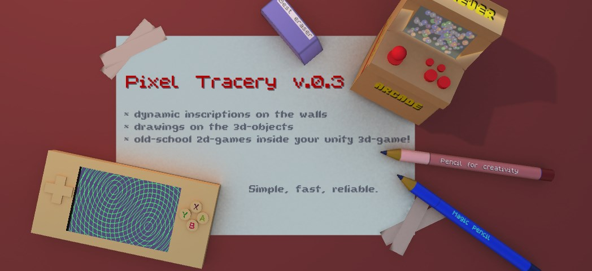

# Pixel Tracery v.0.3
## Unity Texture2D extension class thath realized draw into Texture2D.

Dynamic inscriptions on the walls, old-school 2d-games inside your unity 3d-game, drawings on objects in 3D-game 
- all this is easy to do with Pixel Tracery!
Do not limit your imagination - Pixel Tracery will help you to make it a reality.
All features are in a single extension class. Simple, fast, reliable.

Main functions:
- print sprites with parameters: scale, flip, rotate, alpha color, tint color, circle shift, mask with position 
- print text with sprite fonts with parameters: scale, flip, rotate, alpha color, tint color, fixed width, auto width
- print geometry:
    Clear, Pixel, Line,
    Circle, Filled Circle,
    Ellipse, Filled Ellipse,
    Rectangle, Filled Rectangle,
    Triangle, Filled Triangle,
    Fill, Quad Bezier

You can use the Palettes utility class, which contains popular palettes of 16 colors, to make working with fixed palettes easier.

Used free pixel fonts: marksman-v1 and Ubble by somepx https://twitter.com/somepx and the standard ZX-Spectrum font.

# Pixel Tracery v.0.3
## Класс расширения Unity Texture2D реализующий печать в Texture2D.

Динамические надписи на стенах, олдскульные 2d-игры в Вашей Unity 3d-игре, рисунки на объектах в 3D-игре 
- всё это легко сделать при помощи Pixel Tracery!
Не ограничивайте Вашу фантазию - Pixel Tracery поможет воплотить её в реальность.
Все возможности находятся в единственном классе расширения. Просто, быстро, надежно.

Основные функции:
- печать спрайтов с параметрами: scale, flip, rotate, alpha color, tint color, circle shift, mask with position  
- печать текста спрайтовыми шрифтами с параметрами: scale, flip, rotate, alpha color, tint color, fixed width, auto width
- печать геометрии:
    Clear, Pixel, Line,
    Circle, Filled Circle,
    Ellipse, Filled Ellipse,
    Rectangle, Filled Rectangle,
    Triangle, Filled Triangle,
    Fill, Quad Bezier

Для удобства работы с фиксированными палитрами можно использовать утилитный класс Palettes, содержащий популярные палитры по 16 цветов.

Используемые бесплатные пиксельные шрифты: marksman-v1 и Ubble от somepx https://twitter.com/somepx и стандартный шрифт ZX-Spectrum

